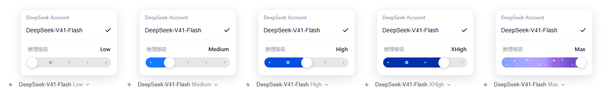

# dsh-reasoning-slider

**推理等级滑块 · Reasoning-effort slider** —— 内嵌在 DeepSeek Harness 模型选择器里的滑条：
点开模型选择器、选中模型，下方就出现该模型支持的推理档位，拖动即可切换
（off / minimal / low / medium / high / xhigh / max）。

A Codex-style reasoning-effort slider embedded in the DeepSeek Harness model selector.
Open the model picker, drag the slider, and the effort level takes effect on release.

- 拖动实时预览、松手生效；换模型自动携带当前档位，目标模型不支持时回退到默认档
- 拖动时**每拉动一格，填充的蓝色就比上一格更深更浓一档**：色相从 210° 慢慢偏到 223.1°、饱和度全程拉满、亮度从 65% 压到 32.7%，最低档是鲜亮的蔚蓝，最高档前的最后一格是**克莱因蓝 `#002FA7`**，max 的紫色渐变保持不变
- 键盘 ←/→ ↑/↓ 与鼠标滚轮都能切档；单档位模型会提示"支持档位"
- Drag to preview · per-model effort fallback · keyboard and wheel support · each notch deepens and saturates the fill blue, up to International Klein Blue




## 安装

需要 pnpm（`npm i -g pnpm`）与 dsh（`npm i -g @deepseek-ai/dsh`）。profile 名按需改成 `desktop` / `web` / `tui`。

**从本仓库安装（推荐，tag 版）**

```sh
dsh plugin --profile desktop add https://github.com/edwardzhou21/dsh-reasoning-slider/archive/refs/tags/v0.0.9.tar.gz
```

**想跟最新提交**

```sh
dsh plugin --profile desktop add https://github.com/edwardzhou21/dsh-reasoning-slider/archive/refs/heads/main.tar.gz
```

> 注意：npm 上的 `reasoning-slider` 是**上游原版**（不含本仓库的改动）。如果只想用原版：
>
> ```sh
> dsh plugin --profile web add reasoning-slider
> ```

## 功能

- 滑块内嵌于模型选择器弹层，选择模型后自动显示该模型支持的推理档位
- 拖动滑块实时预览，松开后生效
- 切换模型时自动携带当前档位；目标模型不支持当前档位时自动回退到其默认档位
- 单档位模型显示"支持档位: xxx"，无档位模型显示提示
- 键盘：←/→ 或 ↑/↓ 切换，滚动滚轮也可切换

## 卸载

```sh
dsh plugin --profile web remove reasoning-slider
```

## 兼容性

`reasoning-slider@0.0.9` 支持 DSH `0.1.2-alpha.2`、`0.1.2-alpha.4`、`0.1.2-alpha.5`、`0.1.2-rc.1` 与 `0.2.0-rc.2`，要求 Node.js `22.13.0` 或更高版本。DSH `0.1.2-alpha.3` 尚未验证。

一次性 `web` Profile 已在 Windows、Node.js `24.19.0`、DSH `0.1.2-alpha.2` 环境，以及 WSL2 Ubuntu、Node.js `22.23.2`、DSH `0.1.2-alpha.4`、`0.1.2-alpha.5`、`0.1.2-rc.1` 环境完成本地插件安装、配置合成、服务冷启动、认证页面响应及卸载复核。

`0.2.0-rc.2` 由 Windows 桌面端（DeepSeek Harness Electron 客户端）实测：插件随 profile 正常加载，模型菜单内滑条正常渲染与交互。

## 开发

```text
dsh-reasoning-slider/
├── lib/
│   ├── index.js   # Node half（纯 UI 插件，apply 为空）
│   └── client.js  # 浏览器 half（完整滑块 UI）
├── cordis.patch.yml
└── package.json   # dsh.bundle 声明：安装后自动成为 profile 层
```

客户端代码是 `window.__ModuleLoader__.load({...})` 格式的普通 JavaScript，无构建步骤；React 通过 `require("react")` 从 dsh 运行时解析。

## 更新日志

### 0.0.9

- 色阶整体**提鲜**：不再只降亮度（那样低档会被冲淡成粉蓝色），改成色相从 `210°` 慢慢偏到 `223.1°`、饱和度全程 `100%`、亮度从 `65%` 压到 `32.7%`。
- 色阶最高档（max 下面那格）改为**克莱因蓝 `#002FA7`**（= `hsl(223.1, 100%, 32.7%)`），最低档是鲜亮的蔚蓝 `#4DA6FF`；每一格都比上一格更深也更浓。最深色依旧铺满最后两格，所以 max 的紫色渐变与它下面那格的位置关系不变。
- 五档模型实测渐变为 `#1579FF → #004FDE → #002FA7`（再往上就是紫色 max）；四档模型为 `#0061F9 → #002FA7`。

### 0.0.8

- 滑条填充改为**逐格加深**：每往上拉动一格，蓝色就比上一格更深一档。做法是把色相（209.1°）与饱和度（100%）钉死，只把亮度从 80% 线性压到 60%，所以看起来始终是"同一个蓝越来越深"，不会换色。
- 最深的一档仍然正好是原来的 `#339CFF`，且最深色铺满最高档与其下一格 —— 因此**最高档的紫色渐变（max）与它下面那格的观感完全不变**，只有更低的档位变浅。只有 1～2 档的模型保持原样。
- 颜色切换带 0.16s 过渡（拖动中即时跟手，不拖尾），`prefers-reduced-motion: reduce` 下自动关闭。

### 0.0.7

- 最高档（max）隐藏刻度点：紫色渐变条上那几颗蓝色刻度点改为随渐变一起 0.22s 淡出，拖离最高档后自动淡回；散落的"能量尘埃"点与扫光保持不变。

更早版本见 git 提交历史。

## 许可

MIT
